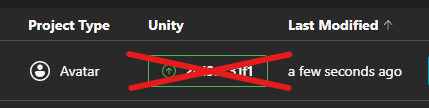
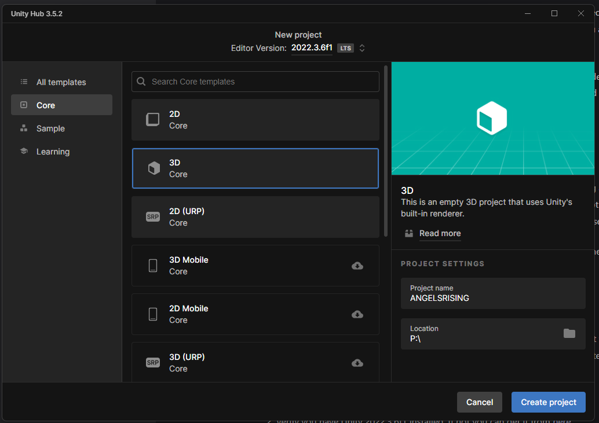
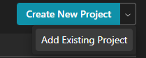
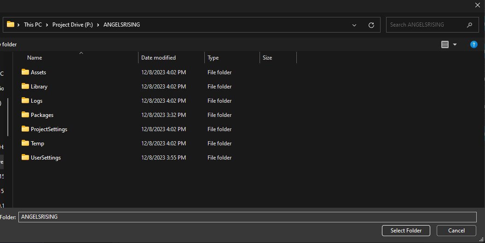
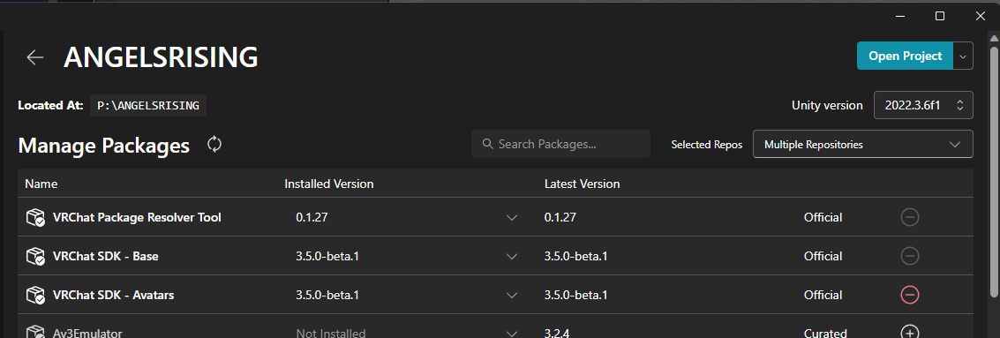
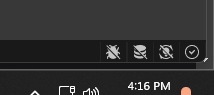
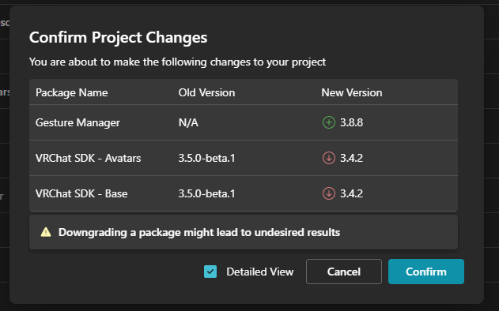
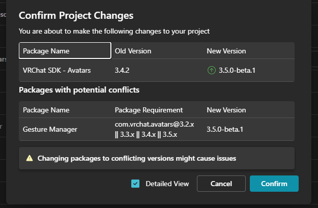
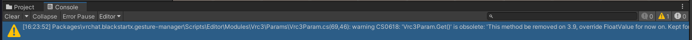
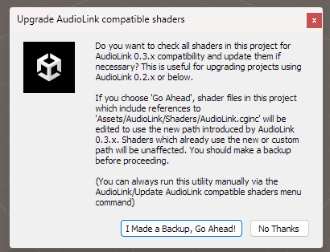

Today the VRChat SDK for Unity 2022, FINALLY!! I'm going to write a quick little how-to on how to get set up without causing any errors, so long as you can verify all of your sources are compatible.

This guide will have a strong focus on creating a boilerplate project that can be used as a strong foundation for any 2022 project. Specifically focused on avatars here as that is what we do.

> ## ⚠️ WARNING!
> While VRChat's Unity 2022 SDK (>=3.5.0) is in release, it's currently recommended by most to wait until around January to upgrade. This is because of the lack of open-beta, which was missed due to a mistake by the VRC team. Before following this guide, be sure to check all tools you rely on are up-to-date.

## Prerequisites

- VRC Creator Companion (VRCC) >= v2.21
- Unity 2022.3.(>=6f1)
- .NET Standard 2.1 or higher ([I recommend downloading the .NET 8.0 SDK](https://dotnet.microsoft.com/en-us/download))

## Warnings!
**DO NOT** upgrade your project using **ONLY** the creator companion's "upgrade" button. Chances of this automation going wrong are unfortunately too high, and it most likely will not account for every edge-case. This should only be used if you are using a VPM-based project with no external dependencies. _Please_ do not trust the creator companion to do your work for you!

**DO NOT** expect things to work perfectly if you are not using the exact recommended Unity Version by VRChat. If there are version-specific bugs, you should not report them _unless_ you are using the exact recommended version. 

Generally, I would use 2022.3.15f1 for this project, as it's the latest version with Shader Graph fixes and some other bugfixes, but I want to participate in the Open-Beta responsibly and part of that is submitting bug reports.

## Initializing our Project
In order to have a strong starting point for your project, I highly recommend creating a new project and transferring items over. The process is generally the same if you were to attempt to upgrade-in-place, but this way we can check for any issues along the way, and fix them before we get too far ahead and lost.

Unity 2022 imports assets much faster than 2019, so don't worry about the extra time this will take comparatively.

## Creating a project
While the VRCC will give you a starting point, I recommend creating a vanilla project with Unity Hub first, to avoid any issues. This way we can validate our starting point before VRCC interacts with anything at all.

1. Open Unity Hub
2. Verify you have Unity 2022.3.6f1 installed. If not you can get it from [here](unityhub://2022.3.6f1/b9e6e7e9fa2d)
3. Be sure to install "Android Build Support" if you are targeting quest. Also install the Visual Studio Community 2022 editor if you do not have your own preferred IDE.

After this is complete we can create our project by heading to the "Projects" tab and clicking the "Create new project" button.
1. Use the template "3D (Core)"
2. Name your project something *without* spaces in it. 

   a. Avoid using any special characters, including underscores as well for cleanliness.
3. Save your project in a User-Accessible location, such as your Documents or an external drive. Now is the time to reorganise things, so choose wisely!

4. Create your project, and let it initialize...

> A quick note on naming.
> - Naming conventions are important and can greatly improve the organization of a project. I recommend using CSharp naming conventions, such as using UpperCamelCase (Also known as Pascal Case) for your project name (i.e. MyProjectFile). [More Info.](https://www.freecodecamp.org/news/coding-best-practices-in-c-sharp/)

## Setting things up for VRCC
Before we can add VRCC, we want to make sure a few things are set up correctly. Some of this the SDK will automatically handle, but it's recommended to check everything first so nothing will break.

### Project Settings (`Edit > Project Settings`)

### - `Editor`
   
Ensure "Enter Play Mode Settings" is **DISABLED**!
I have no idea when this trend started with creators in the VRChat community, but enabling `Reload Domain` and `Reload Scene` **WILL** cause issues with various tools. To name a few:
  - VRCFury (Will never launch / run in play mode)
  - Modular Avatar (The same as the former, though I haven't tested it personally.)
  - Any tool using static variables that are not re-initialized correctly (which is a huge amount of them).

While it may chop 1-5 seconds off of load times, this will generally break at least *something* you are using in your project, _especially_ those using build pre-processors. With the update of a Public API in the VRCSDK, this will become more common as well.

Every time I have mentioned these issues, I'm met with criticism about how "I make my stuff from scratch I don't use X plugin". That's fine, but if you _truely_ know what you're doing, this wouldn't be an argument.

### - `Player`
These settings control how Unity will build scripts in your project. They are very sensitive, but there are a couple things you can change now to speed up our process.

- `Other Settings`

   Set your `Configuration` to use `IL2CPP` as the scripting backend, and be sure the compatibility level is set to `.NET Standard 2.1`. Everything else can be left the same.

### - Editor Preferences `(Edit > Preferences)`
These should mostly be the same as your last project, but we can run over a couple to double-check.

`General`

- Disable Analytics: ✅
- Script Changes while Playing: `Stop Playing and Recompile`
  - This one is optional, and may not be recommended by all, but I do this to avoid errors if I accidentally forget to stop the editor while editing C# scripts.
- Editor Theme: (Subjective)
- Editor Font: If you have a language requirement, you can change the font here.
- Perform Bump Map Check: ✅ (If you want Unity to try to auto-detect normal maps).

`Colors`

A lot of people ask my why my editor turns obnoxious red when I am in play mode, this is just so I know I'm in play mode when editing things like physbones. You can edit this here.
- General / Playmode Tint: `<Some colour>`

`External Tools`

This is where you can set your text editor. I recommend using Jetbrains Rider if you have it, otherwise Visual Studio Code.

- External Script Editor: `<Your Script Editor>`

> If you are using Rider, be sure to enable "Pass Console to Rider" in the `Rider` tab!

`Search`

- Asset Store (store:): ❎

`UI Scaling`

If using a screen with a high resolution, you might want to change this setting.

#### Finished! Close and restart the editor now!

## Setting up VRCC
Wait for your project to open. VRCC Connects to projects over a network socket so you may interact with it while it's open.

After it is open, open the VRCC and add the project by clicking the V next to `Create New Project` in the `Projects` tab.

Choose the project we just created's root folder. Like this:

Click `Manage Project.`

> I noticed my VRCC complaining about this version of the editor not being installed. To fix this I had to manually add the editor using the "Add" button when clicking the orange "Open Project" button. Adding the editor path at `C:\Program Files\Unity\Hub\Editor\2022.3.6f1\Editor\Unity.exe` should fix this.

Next we need to add the `VRChat SDK - Avatars` package. Selecting this will automatically install the dependency packages like `Base, and VPM`

After this click back into the editor and wait for the packages to install. You'll also begin to notice here how much nicer 2022 is! It's actually using all of your CPU to import things! That's great!!

> 2022 will run some background tasks, be sure these are finished before continuing by looking for the checkbox in the very bottom right.
> 
>

Now you can install any package dependencies you may have. Try to do these one by one for now to make sure there are no issues in the editor. Check the editor with each package you have and wait for the recompile to finish. Everything should work smoothly!

> **IMPORTANT NOTE:** The VRCC will sometimes ignore packages defining above versions are compatible, and you'll get a screen like this. **BE SURE TO UPGRADE THE DOWNGRADED PACKAGES AGAIN!** otherwise things *will* break.
> This issue is a bug with semantic versioning and [has been reported.](https://github.com/vrchat-community/creator-companion/issues/390)
> 
> 
> 
> Ignore this if you know the package works!
> 
> 
> 
> Notice the "Package requirement" of `3.5.x` not detecting `3.5.0-beta.1`
> 
> Update: This seems to have been fixed by the team publishing version numbers without a pre-release suffix. I.e. 3.5.0

> Warnings like this *can* be ignored! 
> 

> Audiolink will throw this error, choose "I made a backup go ahead!"
> 
>

## Finally, importing assets!

So long as you do not have any outdated editor scripts, you should be able to copy anything in your previous project's assets folder, over to this 2022 project without issue.

I was able personally, to copy over all of my assets, along with avatar scripts, and not get hung up on anything. If something breaks, there's a good chance you've imported something like a script to your project that shouldn't have been imported.

You also may notice again how fast things import!!!

With this however, you should be good to go with a solid foundation for your 2022 experiments! Have fun!

