High-to-Low baking is the process of baking high poly mesh details into a normal map, which can then be used to replicate the same detail on a lower-poly model. We use this extensively in game development, to lower the amount of "gpu power" needed to render a model's polygons, where VRAM is available.

This may seem counter-intuitive when creating models for a game that already has seemingly high memory usage, but chances are most people are going to be using normal maps for other details anyways, so baking your map to a lower base is a fair tradeoff.

For this I am going to be using the following tools:

- Blender
- Substance Painter
- Unity
- Poiyomi 9.0.x (Any normal-mapped or PBR shader will work.)

### Blender

To begin I need a high poly base that I want to lower the poly count of. I am using [Zinpia's amazing fit-base](https://zinpia.sellfy.store/p/zin-fit-base/) for this. I highly recommend this base to everybody, if you are looking for something new to work with, Zinpia's assets are amazing to work with, as they are incredibly well made, and feel like they were made with creator modification in mind. I wasn't paid to say this, I just genuinely love this base and prefer it over my own scratch items, as I just don't think there's a reason to try and top it's quality.

Because I am using the Fit base, I can quickly decimate from ~44k to ~20k fairly quickly by using [checker-deselect](https://docs.blender.org/manual/en/latest/modeling/meshes/selecting/checker_deselect.html) style decimation methods. However, this is out of the scope of this guide currently. Any base that has matching meshes in both High and Low poly will work, you can also use a [subdivision surface modifier](https://docs.blender.org/manual/en/latest/modeling/modifiers/generate/subdivision_surface.html) on your model to quickly get some more detail out of it, which I've done here on top of the already high-poly base.

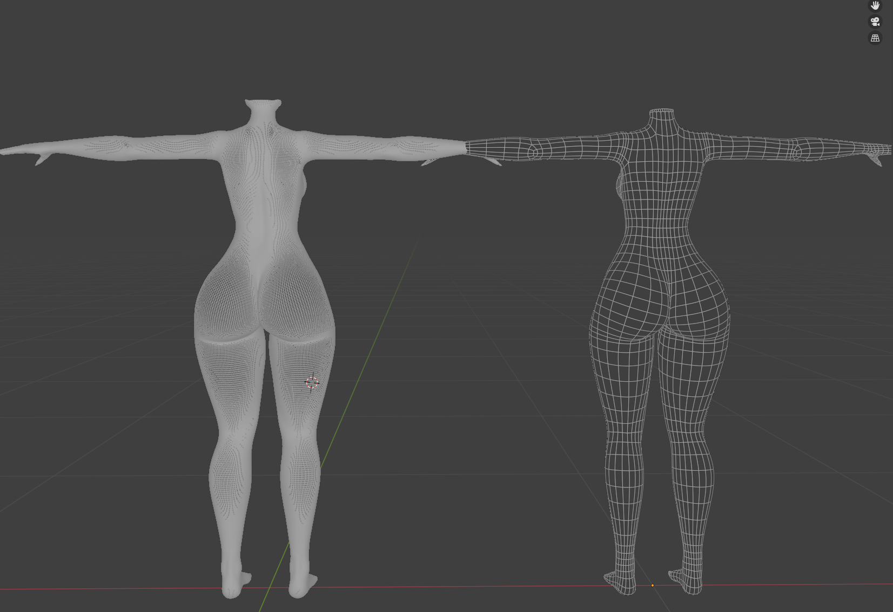

> ⚠️ Do note something here, if you are keen-eyed, you may have noticed my high-poly base has some extra mesh around the neck area. This is fine, as I cannot see this part of the mesh normally, however this is generally something you'd want to avoid. The goal is to have identical meshes.

After this is done, I have, as I mentioned, added a [subdivision surface modifier](https://docs.blender.org/manual/en/latest/modeling/modifiers/generate/subdivision_surface.html) here. This will usually net cleaner results, but is not required if your high-poly mesh is high-poly enough. Although I generally shoot for upwards of 700k polygons when exporting a high-poly mesh (wow!).

Now you need to export the meshes as two seperate FBX files. Good practice is to name them the same thing and put them in the same location, with a `_high` and `_low` suffix.
```
📂Root
    |
    |-- Body_high.fbx
    |-- Body_low.fbx
```

After this is done, we need to move over to Substance Painter.

### Substance Painter 

> ℹ️ I am currently using Substance Painter version 9.0.0, if you are using the steam (legacy) version, or version 8.x.x, these steps will vary slightly in UI but the methods will be the same.

In Substance Painter, we need to create a new project using our mesh, I personally always work in 4k and downscale as my very last step, letting Unity take care of the downscaling.

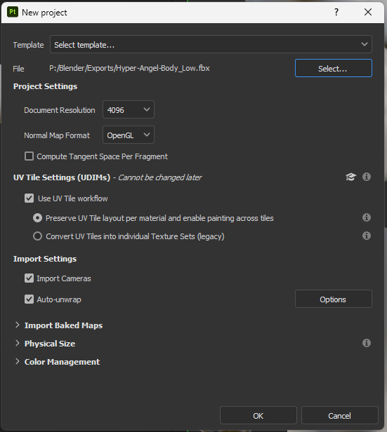

> ℹ️ Please be aware, if you have a UV Discard setup for Poiyomi or another shader, you need to use the UV Tile Workflow, otherwise those areas will not be textured. I generally recommend using a standard UV map for this.

Next, head to the baking view by hitting the little croissant Icon, or View > Baking.
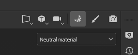

We can set up our bake by first adding our High poly mesh, and copying my settings...
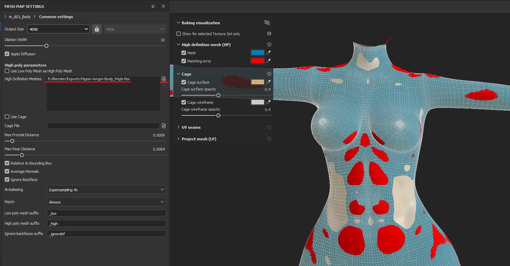

You will quickly notice a ton of red, this is bad, this is where our source mesh is *not on-top* of our body mesh. You can sometimes get away with a bit of red, as it can be made up for with backfaces, but a rule of thumb for solid bakes, is just to avoid it completely.

To adjust this, we need to modify our `Max Frontal Distance` until it's just barely all blue, meaning right when you stop seeing red, is where this slider should be. I also usually set my `Max Rear Distance` to something around `0.1`, this entirely depends on your model, but when the models are very similar, this value is generally fine.

The idea is that you are extruding a "Cage" around the mesh, using the High poly mesh. It's sort of the same idea if you were to extrude the faces of the body outward, and surround your low poly mesh with a High-poly one.

If you have difficulty here, a good solution is to open Blender and inflate problem areas of your model so they are sitting just on top, or on the same level as your low-poly.

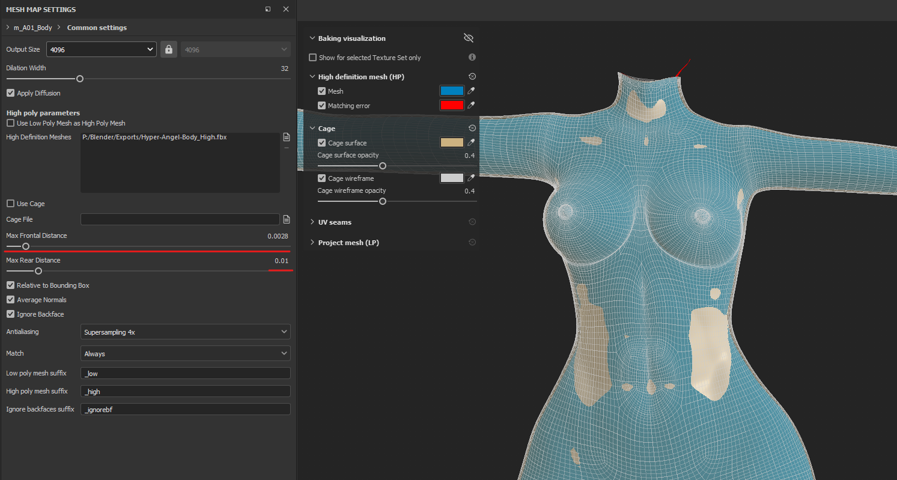

After this is done, we need to set our resolution and AA, along with choosing the bakes we want to do.

For testing, I would set your resolution to 512x512 and skip the Anti-Aliasing for now. I also generally bake all of the available maps, as they can help with certain smart materials if you are planning on editing this. You can remove them as you please, but at a minimum try to have `Normal`, `World-Space Normal`, `AO`, and `Curvature`

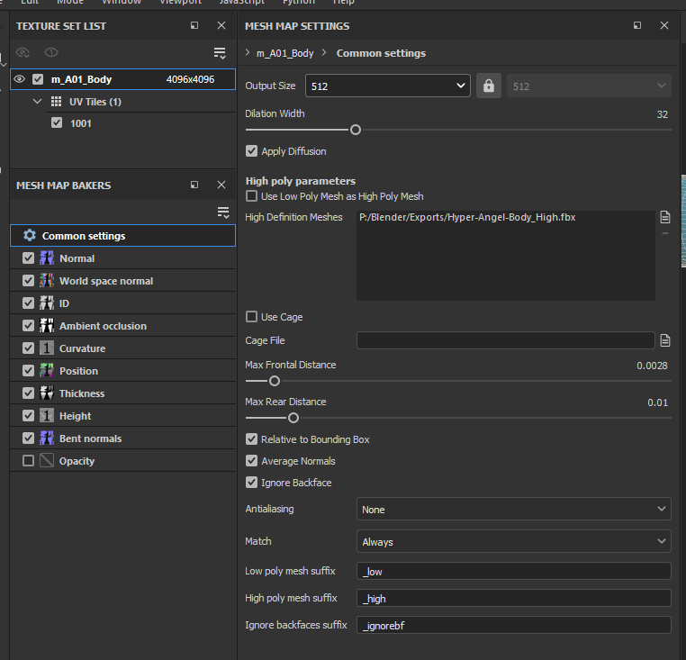

After this, we can test, hit **Bake Textures**

After our test is complete, be sure there are no "Dark Spots" on your mesh, this would indicate a face has no high-poly projection onto it, thus causing the normals to be invalid. A good test bake looks like this:
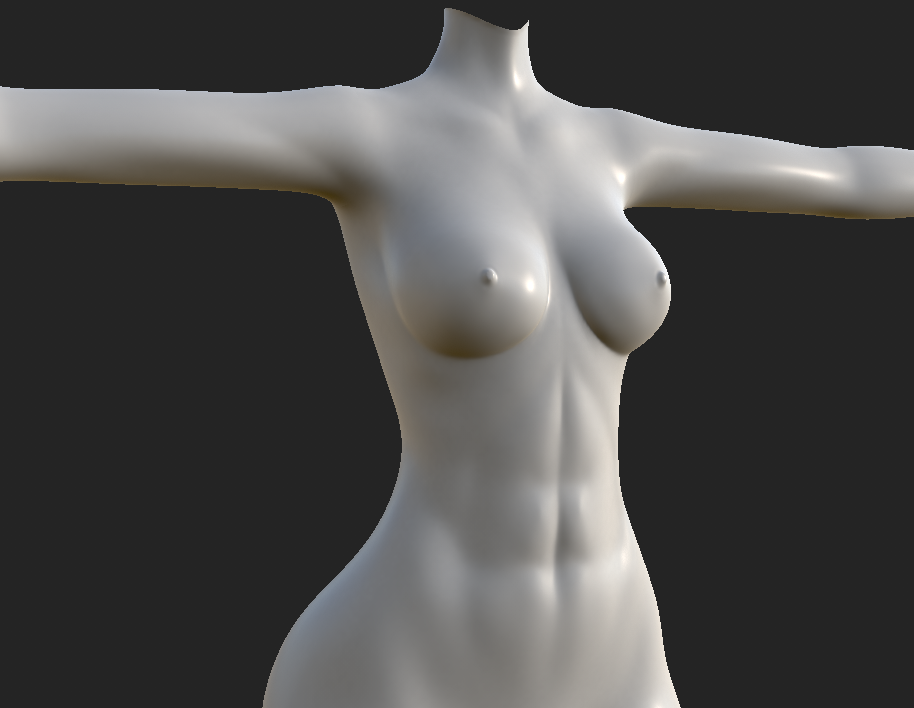

Whereas a bad test would look like this, exaggerated for show:
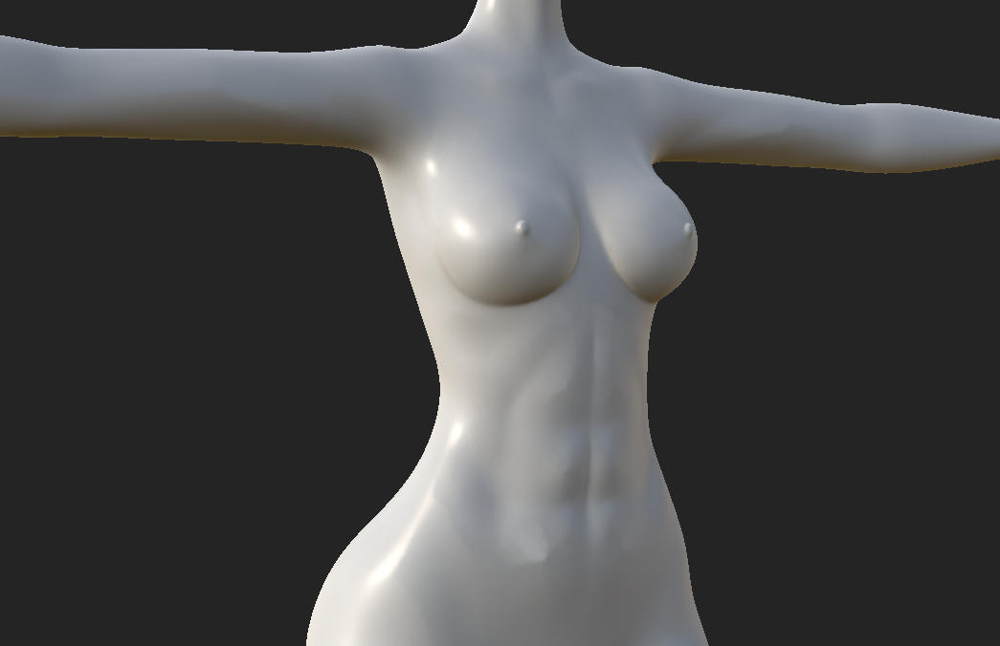

Notice Dark Spots like these, these are errors:
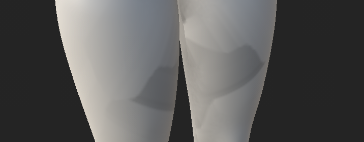

After we have confirmed our settings are good, we can up the resolution and AA of our bake like so:
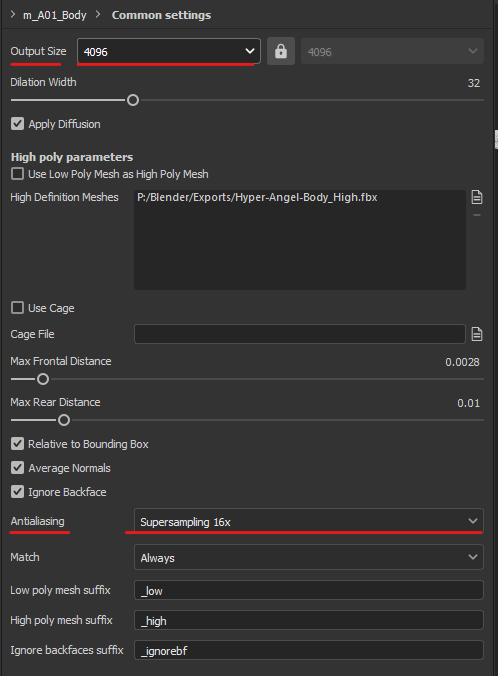

Sit tight, as this bake may take a couple of minutes, depending on your GPU and the amount of Anti-Aliasing you are doing. 16x is fine for most things, sometimes even 4x will do. 64x is overkill in my opinion, but is useful if you don't have much texel density to work with.

> ⚠️ If you notice issues with your seam lines appearing through your bake, be sure to enable Dialation & Diffusion. This will help mitigate the microscopic space that appears in-between textures in some instances.

After we have a clean bake, we can move on to exporting our textures.

#### Exporting

I have [written another guide on this](https://www.notion.so/angelware/What-Do-All-These-Textures-Do-f1fece244ef5446ba229159db0da2751?pvs=4), that is currently on my notion, and not ported over yet.

Essentially the most important file we need out of this, is our OpenGL format Normal Map.
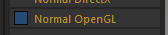

I personally always export opaque textures with infinite dialation, and at 4k. Don't forget to name your textures properly!

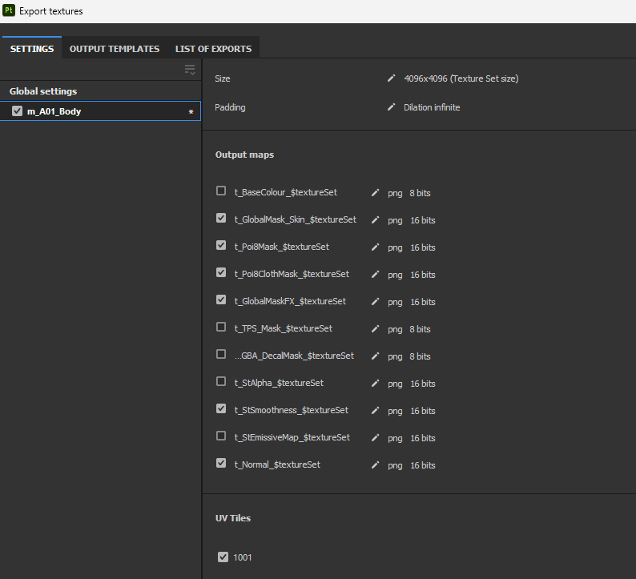

My final result looks something like this:
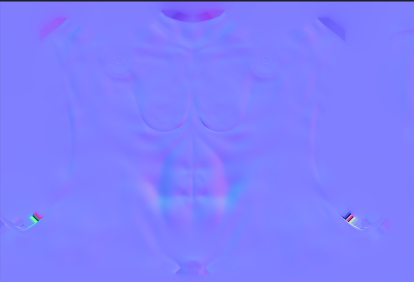

After this is complete, we can edit textures in Photoshop, or head straight into Unity!

### Unity

In Unity, these maps can be used like any other. Since we are mainly focused on Normal maps, I'll demo that here, but you can also use the AO map for a quick Ambient Occlusion baked map.

In our body material, assign the Normal Map texture to the main Normal slot, if you have detail normals, like skin texture, put those in the detail map slots or use RGBA slots.

For our import settings, be sure the texture is set to `Normal Map` with the Size set to something smaller, usually I use `1024x` for this, with `High Quality` as our compressor type. The reason for this is that normal maps use 4 channels at all times, meaning we don't take up any extra Video Memory by using a Higher Quality compressor.

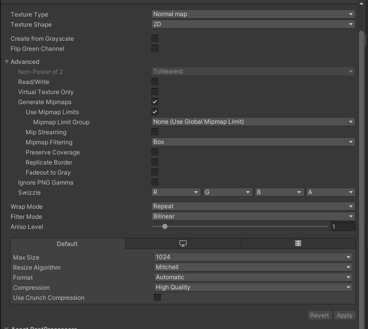

> ⚠️ You should never need to use 4k normal maps for any texture, unless it is **heavily** atlased. 1k will do fine here, and 2k will do fine in any situation that requires more detail, but try to use it sparingly. Remember that we will always see more detail in-editor, than in-game, sometimes the extra pixels are just not worth the memory.

#### Before

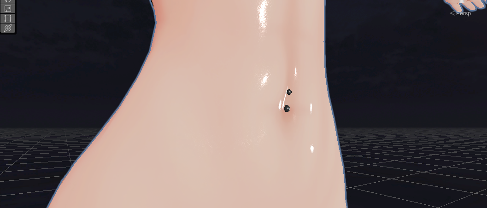

#### After

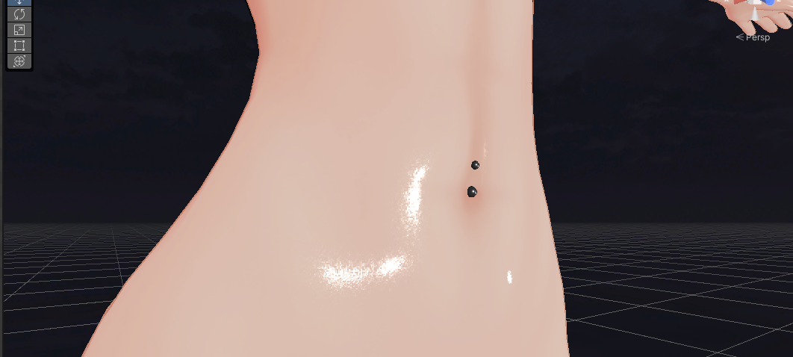

On my model, the difference is extremely subtle due to my lighting setup, however on most others, the difference will be quite significant. The primary fixes won't be noticible by others, but it will be better than not having them at all. This revolves around normal consistency, and polygon location (such as those that are in high-movement areas).

This method has allowed me to lower my count below 70k, and using this I could achieve a Good rated avatar, *without* losing fidelity!
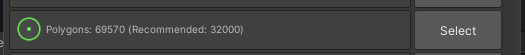

### Further Reading
[Baking in Substance Painter, official guide / docs](https://helpx.adobe.com/substance-3d-painter/using/baking.html)

[Official Substance Painter Baking YouTube Tutorial](https://www.youtube.com/watch?v=hYtHp4IXvsM)

[Unity Normal Map Import Documentation](https://docs.unity3d.com/Manual/texture-type-normal-map.html)

[What do all these textures do!? - A Substance preset guide by me](https://www.notion.so/angelware/What-Do-All-These-Textures-Do-f1fece244ef5446ba229159db0da2751?pvs=4)

### Links
My site / storefront [ANGELWARE.NET](https://angelware.net/)

[My tweets](https://twitter.com/dividedangeI)

If this helped you, share with a friend and spread some optimization knowledge! Each texture makes a difference, and gives a cleaner experience for everyone, including yourself!

If I have made any mistakes, please make an issue on my [index's Github repo](https://github.com/uhKayla/AW_Index)