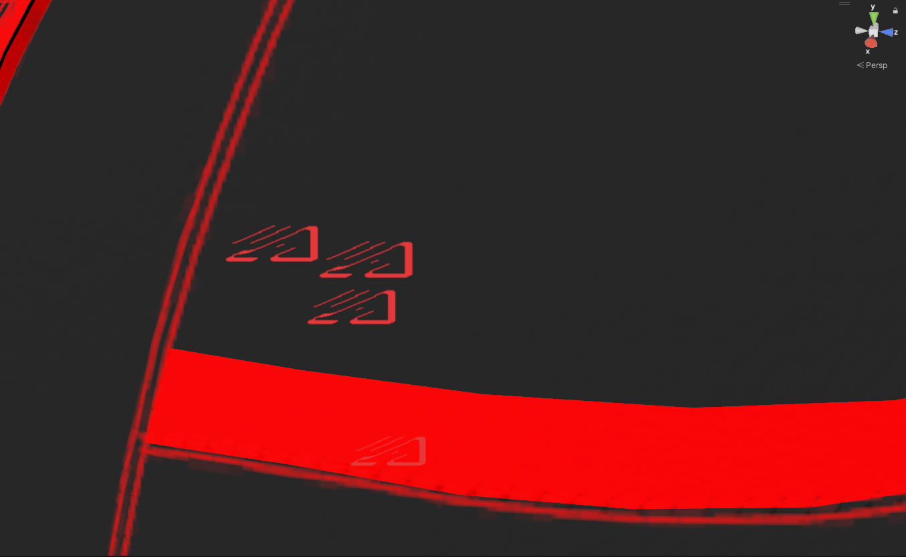
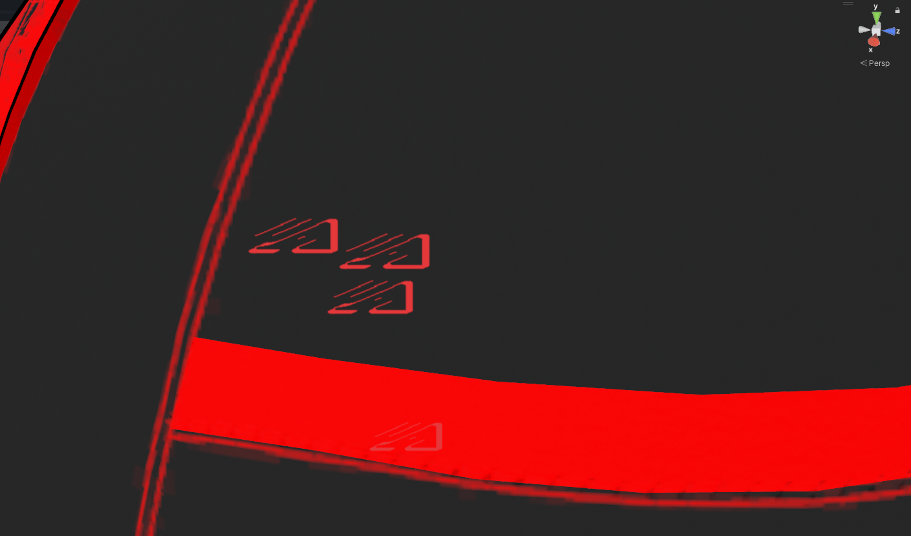
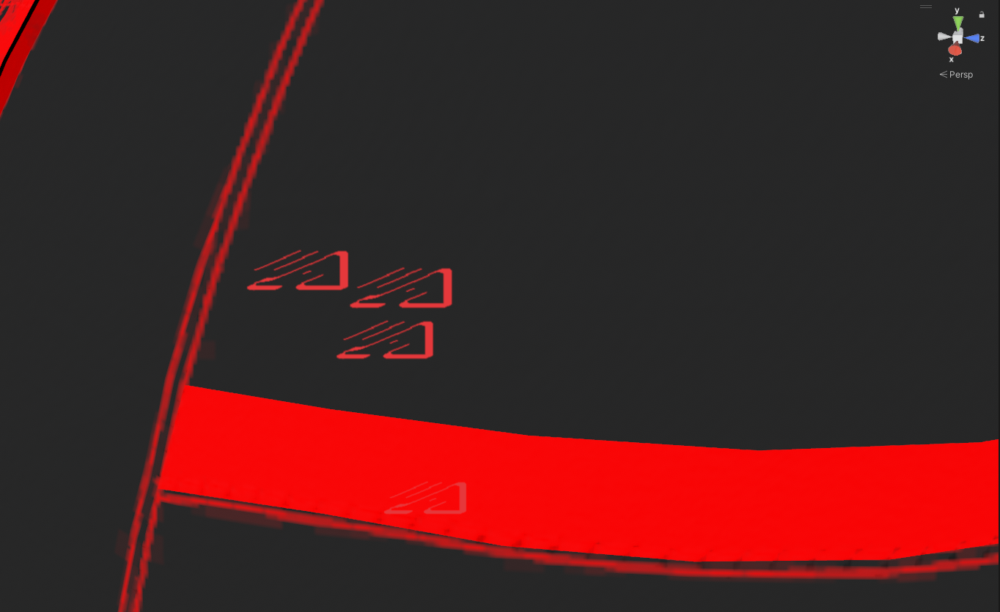
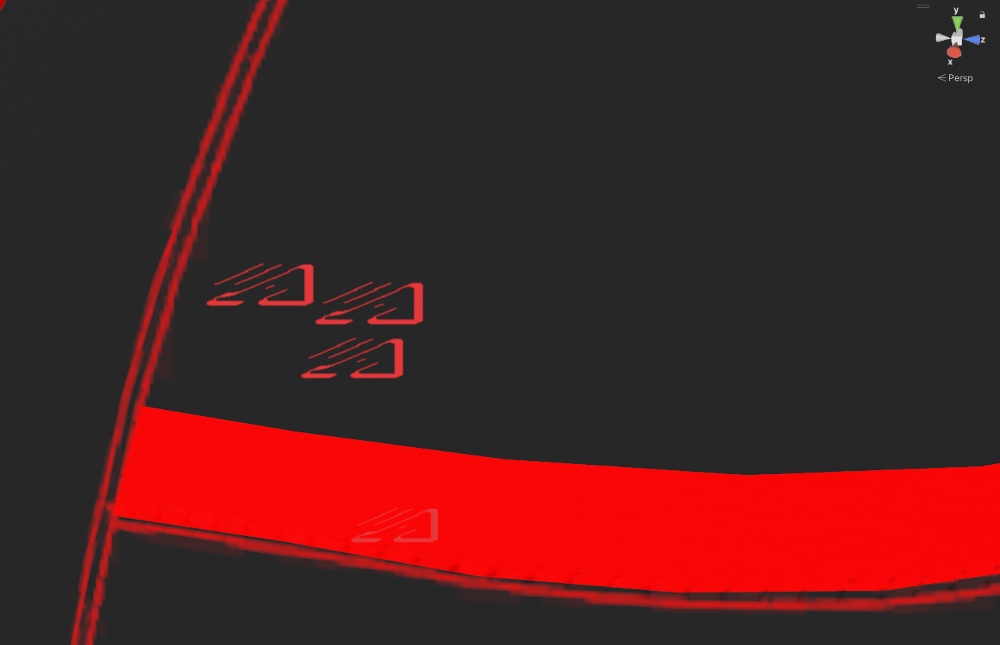
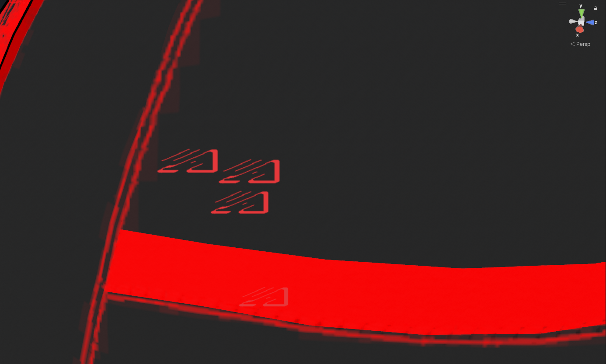

 

[Or check out my assets!](https://angelware.net/)

--- 

Crunch compression, not to be confused with "normal" compression, is a seperate type of compression that works alongside standard DXT (or ETC) compression. It uses a variable bit-rate compressor to compress the size of the file on the disk, while uncompressing it at runtime for very minimal quality loss.

Effectively, crunch compression is related to download size, not video memory. 

### How and when do I know to use it?

Compressing textures can be a bit tricky, and there is tons of misinformation within the VRChat community that makes this topic extremely hard to learn and understand for a beginner. I've heard both sides of the coin, the worst being that you "should not use crunch compression as it causes lag spikes on load", which is actually just an unfortunate misuse of the technology.

Below, I've outlined some general, loose guidelines for compressing textures _effectively_, in order to _reduce load times_ while not *overusing* crunch compression. 

### What happens if I do not use crunch compression?

This one is simple, your avatar's download size will be larger. Much larger. This creates problems when users with poor connections try to download an avatar, as it will take them much longer to load and see you, than it would if you were otherwise using crunch compression.

This is where we get 300mb avatar downloads, even if they are not high detail, as each uncompressed high-quality 2k texture is apx. 5.3mb, i.e. every single normal map and colour map on the avatar.

### What happens if I overuse crunch compression?

This is a little more complicated, but gives us a solid segway into talking about what happens at runtime with crunch compression.

I've been saying crunch compression over and over, so I am going to shorten it to CC.

When you download an avatar in VRChat, the client needs to unpack all of the textures and load them into memory. While this is happening, the CPU will uncompress CC'd textures on the fly. This is excellent for disk size, but it does require a tiny bit of CPU time in order to uncompress these textures. If you have a lot of CC'd textures on your avatar that either use very high quality (90-100%) crunch compression, or are just large textures being uncompressed, you can get a bit of a stutter, lag-spike, hitch, or whatever you want to call it.

**This is where misinformation comes in.** A common thing heard in VRC is not to use CC because it will cause lag spikes when players load into lobbies. **This is true.** However, it is **only true if crunch compression is being overused**, for example 80-100% quality on every single texture.

It will cause your CPU to use all of it's resources to unpack the textures as fast as possible, causing a momentary lag spike within your game.

**However, please keep in mind, this is a misuse of crunch compression, and a fundamental misunderstanding of how and when to utilise it.**

### So if it causes lag, when should I use it? I don't want my model to be huge!

My personal general rule of thumb is this;

| Use? | Use Case                                                         |
|------|------------------------------------------------------------------|
| ❌    | High Detail Color Maps (Gradients, Skin, etc.)                   |
| ✔️   | Lower Detail Color Maps (Outfit Textures, Base Color Maps, etc.) |
| ✔️   | Normal Maps with Low Detail                                      |
| ❌    | *Some* Normal Maps with High Detail*                             |
| ✔️   | Metallic, Smoothness, AO, etc. Maps                              |
| ✔️   | Other maps, such as Matcap Maps, Glitter Masks, etc.             |
| ❌    | Matcaps, Gradient Maps, Texture Ramps                            |
| ✔️   | Cubemaps                                                         |

> *This one is _very_ subjective, but generally normal maps *should* be crunch compressed.

As you can see, it's very subjective, and highly dependent on the complexity of the texture, but as a general rule of thumb, anything that doesn't require 1.) High color detail or 2.) High detail complexity, should be crunch compressed.

I also generally crunch compress any 2k texture that doesn't have high color detail.

### What about quality settings?

Generally, I use 70-80% quality on crunch compression. This will result in minimal loss of detail, but doesn't go *too* overboard and hog all of your CPU time at load.

> ℹ️ Images here are compressed to be sent across the web, so they aren't *super* accurate, and don't do the best job representing what they actually look like within the editor.

> No Compression

> 100% Compression Quality

> 80% Compression Quality

> 50% Compression Quality

> 10% Compression Quality

As you can see, this is a very high detail map, so personally, I would avoid using CC on it if possible, but it proves as a good example. 

If you have enabled CC, in the range of 50%-80% is where you generally want to shoot, as most things don't lose much quality within this range. Setting it too low, however, will cause artifacting on the texture. Setting it too high will result in CPU lag, if done on too many textures at once.

### This isn't a very clear guideline...

I know! That's because when and where to use CC is very subjective, the point is, it's a balancing act. Nobody wants to download a 300mb avatar, but nobody wants to unload and spike their CPU loading 300mb worth of textures compressed down to 10mb.

So long as your CC'ing ~50%-80% of your textures, you're usually in the green!

## Further Reading

[Crunch Compression: Unity Documentation](https://docs.unity3d.com/Manual/texture-compression-formats.html)
[Texture Optimization: Crunch and You by Razgriz for Poiyomi](https://www.poiyomi.com/blog/2022-10-17-texture-optimization#crunch-and-you)

## Wrap-up

If this helped you, consider [tossing me a Kofi](https://ko-fi.com/angelware)

 

[Or check out my assets!](https://angelware.net/)

Make sure to share this with friends to help share the knowledge!

If I have made any mistakes, please make an issue on my [index's Github repo](https://github.com/uhKayla/AW_Index)

