 

[Or check out my assets!](https://angelware.net/)

--- 

Requirements:\
Unity 2022\
Photoshop

---

I've recently seen a lot of photos taken in worlds with Ambient Occlusion, sometimes referred to as MSVO. However, while a lot of these photos look fantastic, there is one glaring problem; the whites of the subject's eyes contain shadows, or have a darker look to them. This doesn't look quite right and can come off a bit creepy in my opinion. 

## Here's how we fix that!

### In Photoshop (or GIMP, etc.)

First we need a mask, this mask should only contain the eye white texture, and nothing else.

1. Use the magic wand tool to select the eye whites, the selection doesn't need to be perfect, as most proper textures provide a bit of wiggle room with texture dialation. 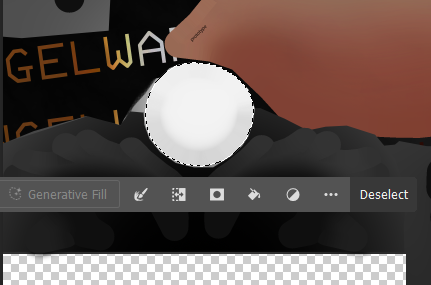
2. Copy this selection to a new layer, use `CTRL + SHIFT + V` to place the object in the same position as where it was copied from. Also add a black fill layer below the texture as our base, make sure this is pure black (`#000000`) otherwise, things won't work correctly. 

The end result should look something like this: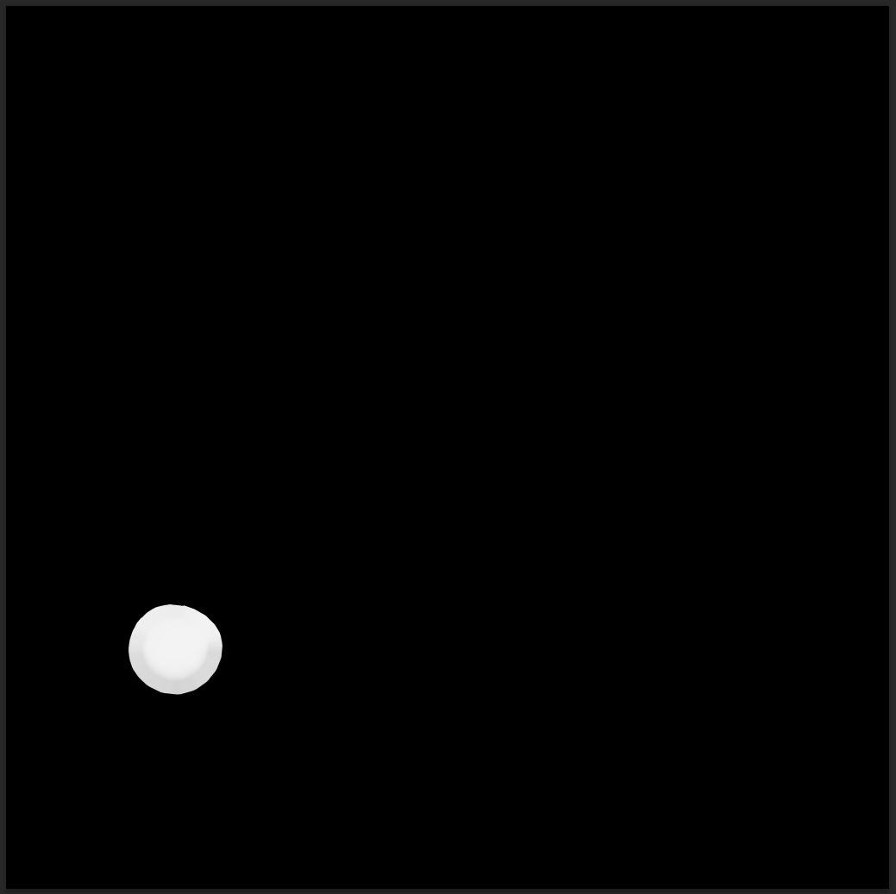

### In Unity

Next we need to create an emission mask, I am using Poiyomi for this, but it is the same for other shaders that have multiple emission layers (Liltoon, etc.)

1. Enable the emission layer (I use slot two for this, but any slot will work! ^^).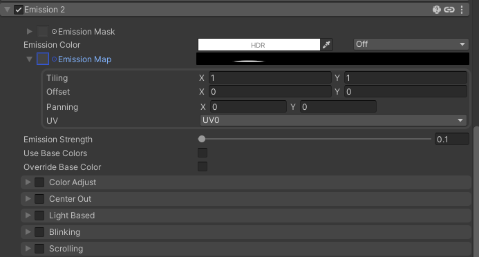
2. Add the masked texture to the `Emission Map` slot. 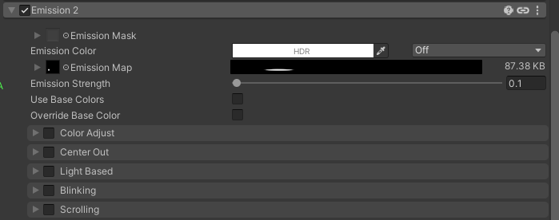
3. Make sure to enable animation for the `Emission Strength` so it will work with the radial we are about to create. 
:::note
You'll notice I leave my default amount at 0.1, this is because I prefer to have a tiny bit of emission behind my eyes at all times, to keep things looking a bit more cohesive, and to avoid shadows in other environments. This is a great way to keep your eyes looking a bit more alive in most environments.
:::

Now, finally, we need to create a radial for this value. The reason I suggest creating a radial here, is because the amount of Emission needed to combat shadows, depends on the world we are in, and how much AO the world is using. With this setup, we can control the amount of Emission our eyes have to avoid blowing out the bloom in pictures, or not having enough to combat shadows.

I will be showing a quick and dirty way to do this with a Blend Tree, so you can incorporate it in your model's other Blend Trees if they exist. This is the most optimized way to make radials. If you already know how to create radials, feel free to skip the rest of this guide ^^.

1. Create two animation clips, one at the minimum (default) value of the emission slider, and one at the maximum. Both of these clips should be single-frame animations (two keyframes) with the same value for both keyframes. I won't go into much depth here, as there are plenty of guides out there on creating animations for avatars.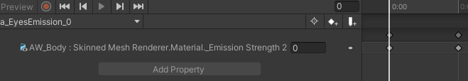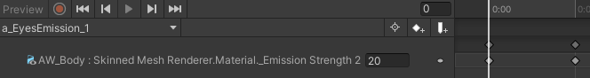
:::note
An emission value of 20 might be too high for the *majority* of worlds, however I personally found it useful in bright worlds, such as WispyWoo's amazing [Sea Breeze](https://vrchat.com/home/world/wrld_41e4eb69-33e2-438f-9462-00ec2c72a146).
:::
2. Next, locate your FX animator, and create a new float parameter, I called mine `Menu/Appearance/EyeWhiteEmission` for organization (Remember, organization is key to a non-breaking project!).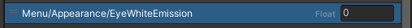
3. Next, locate the layer with your main DBT and create a new 1D Blendtree as a child. Set the parameter to your 'OneFloat' parameter. This is just an additional float parameter that always has a value of 1. It should look something like this.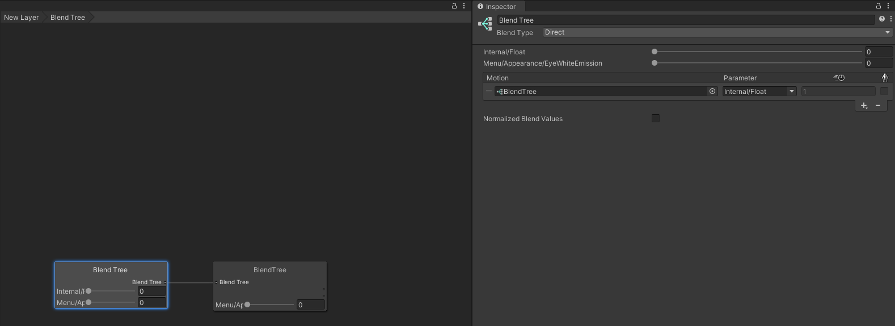
4. Inside the newly-created 1D tree, add both of our new animations, with the parameter set to our newly created parameter. The end result should look like this: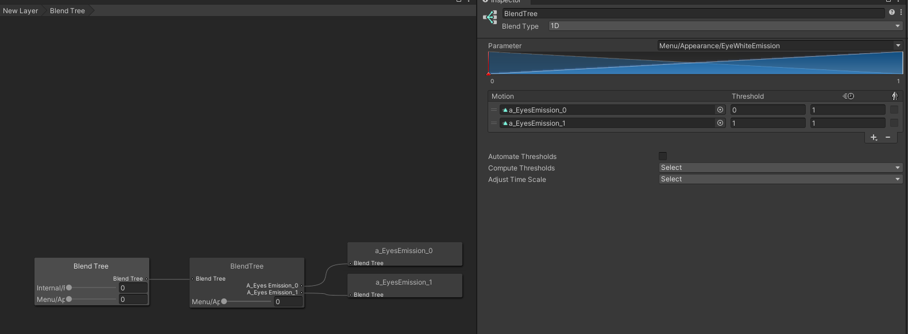
:::note
If you get stuck here, you can read more into the creation of tree radials, following the guide at the bottom of the page.
:::
5. Finally, we need to create our parameter in our VRCParametersList and our VRCExpressionMenu in order to control things in game. This is how I set mine up.\
    a. Create a new Radial in our menu: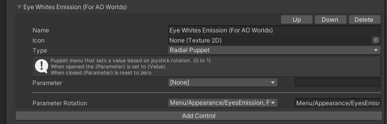
    b. Create a new synced float parameter in our list, and set your default value (usually zero, but as I mentioned before, I like having a small amount of emission behind my eyes):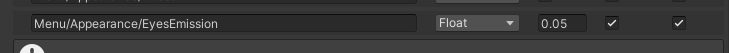

### With this, we're finished!
You should now be able to hide those pesky shadows behind your eyes, and look a little bit less like a demon ^^ (unless you're into that).

## Further Reading

[VRC.School: Creating Radial Puppets](https://vrc.school/docs/Avatars/Radial-Puppets/#blend-tree)

## Wrap-up

If this helped you, consider [tossing me a Kofi](https://ko-fi.com/angelware)

 

[Or check out my assets!](https://angelware.net/)

Make sure to share this with friends to help share the knowledge!

If I have made any mistakes, please make an issue on my [index's Github repo](https://github.com/kay-xr/AW_Index)

