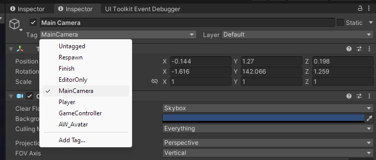

 

[Or check out my assets!](https://angelware.net/)

--- 

Requirements:
Unity 2019 or 2022.
Post Processing Package from Package Manager.

#### Install Post Processing
Post-Processing is not installed by default in the editor, you need to add the package manually. You can do this via the package manager (`Window > Package Manager`)

Once it is added, we can begin setting things up.

### Setup

A basic concept in Unity's engine is the concept of [Layers](https://docs.unity3d.com/Manual/Layers.html). Layers are used for certain objects to seperately only interact with each other. We will put our Post-Processing stack on it's own layer.

First, create both an Empty Game Object and a Camera. You should already have a Main Camera in your scene that you can use.

On our Main Camera, we need to add a [Post-Processing Layer](https://docs.unity3d.com/Packages/com.unity.postprocessing@3.3/manual/Quick-start.html#post-process-layer) component, to add our PP layer to the viewport. Set it up like this, and be sure your camera is tagged as the Main Camera. 

Here I am going to use the Water layer, as it's default and not used in Avatar projects.

Next we need to set up our PP Volume, this will be where we create and manage our effects. For this we need to set our GameObject we created to the Water Layer, and create a [Post-Processing Volume](https://docs.unity3d.com/Packages/com.unity.postprocessing@3.3/manual/Quick-start.html#post-process-volume) component.

Set the parameters up similar to mine below, ensuring `Is Global` is active, as this will show our PP layer for the entire world.

We also need to make a new preset by clicking the `New` button.

After this, our layer should be set up and working, let's test it!

### Effects

##### Bloom

A common effect seen in 90% of VRC worlds is [Bloom](https://en.wikipedia.org/wiki/Bloom_(shader_effect)). Bloom is basically the effect that happens when a light is above a certain threshold, causing it to leak outwards, feathering from the edges.

Source: https://appuals.com/bloom-in-games-explained/

To set up a basic visualization of this, we can set up a Bloom effect with a slightly lower threshold, to simulate that of a VRChat world.

Left is before, Right is after

Setting a higher intensity will lead to more exaggerated results, keep in mind, most bloom is *intended* to be used above 1.0f of light, so the threshold should be around there, but most world will lower it between 0.7 - 1.0.

Left is before, Right is after

Here are the basic settings I am using right now for this effect.

You can also add a Lens Dirt mask to visualize things a bit better and prettier, you can save the one I have posted here and use it.

#### Chromatic Aberration

[Chromatic Aberration](https://en.wikipedia.org/wiki/Chromatic_aberration) is another effect I *occasionally* see in VR. It is basically the light separating near the edges of the frame, to replicate a real camera lens. You can set it up like this

Left is before, Right is after

This is an exaggerated example, but you just need to crank the intensity for this one.

#### Vignette

Similar to Chromatic Aberration, [Vignetting](https://en.wikipedia.org/wiki/Vignetting) is the darkening of an image around the edges of the frame, in order to simulate the effect of a real lens.

Similarly, you can set it up by just moving the intensity slider.

Left is before, Right is after

#### Grain

Grain is meant to mimic film-grain from a cinematic camera. This can be added via intensity, and has a control for colourization.

Left is before, Right is after

#### Color Grading, Auto Exposure, Etc.

> ⚠️ These settings can effect your perception of your avatar in your scene. It's recommended to test with them on and off if you use them! As such, I personally recommend you avoid these sorts of settings.

### FAQ

##### Q. I cant see any effects, why!

a. There is a chance your post processing is disabled in your main viewport, you can re-enable it with the layers button.

If you are still experiencing issues, be sure your Camera is tagged as your Main Camera

And be sure you are using the same layer for your Post Processing Volume and Layer

##### Q. When using post-processing, my effects do not look the same as X world.
a. This is purely because these effects are specifically for viewing in your editor, the world you are testing in is very likely using different settings, play around with yours and see if you can match it for predictability.

##### Q. Lighting isn't effecting my scene!
a. You more than likely have lighting off. This can be enabled with the lighting button.

### Further Reading

[Bloom (Wikipedia)](https://en.wikipedia.org/wiki/Bloom_(shader_effect))

[Bloom in Games Explained](https://appuals.com/bloom-in-games-explained/)

[Chromatic Aberration (Wikipedia)](https://en.wikipedia.org/wiki/Chromatic_aberration)

[Vignetting (Wikipedia)](https://en.wikipedia.org/wiki/Vignetting)

[Unity Post Processing V2, Getting started](https://docs.unity3d.com/Packages/com.unity.postprocessing@3.3/manual/Quick-start.html)

[Unity Post Processing V2, Manual](https://docs.unity3d.com/Packages/com.unity.postprocessing@3.3/manual/index.html)

### Wrap-up

If this helped you, consider [tossing me a Kofi](https://ko-fi.com/angelware)

 

[Or check out my assets!](https://angelware.net/)

Make sure to share this with friends to help share the knowledge!

If I have made any mistakes, please make an issue on my [index's Github repo](https://github.com/kay-xr/AW_Index)

