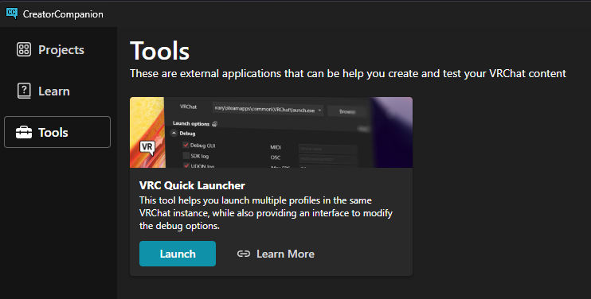
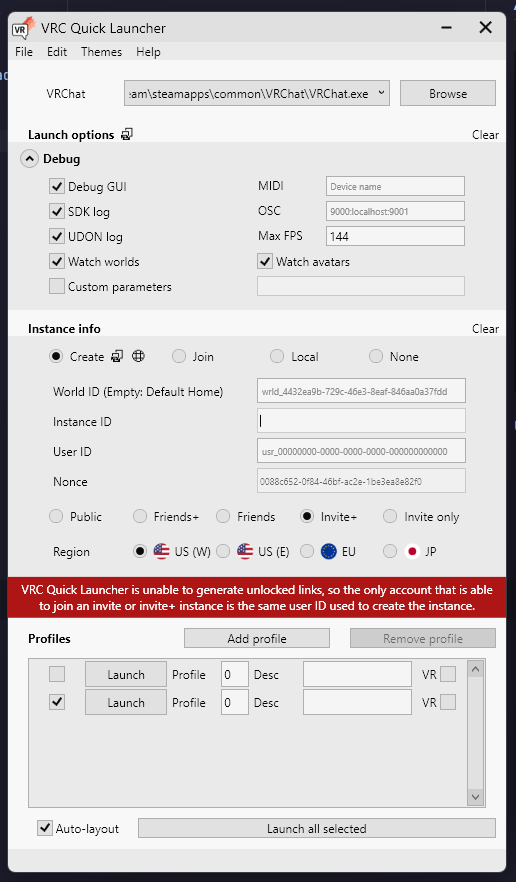

# Quick Tips
Below you will find a collection of random tips and tricks I have come across over time. Use the sidebar on the right to navigate.

---

## Use the VRCQuickLauncher for quick testing!
A small unknown tool in the Creator Companion, "Quick Launcher", can be found in the `Tools` section of the VCC.

Using this, you can quickly launch the VRChat client in offline mode, without waiting for things like EAC to load. It also supports things such as automatic reloading and various debugging tools.

You can fill out fields like the `World ID`, `User ID`, etc, for specifying online options, or use `Local` mode to launch the client directly into a locally built world.