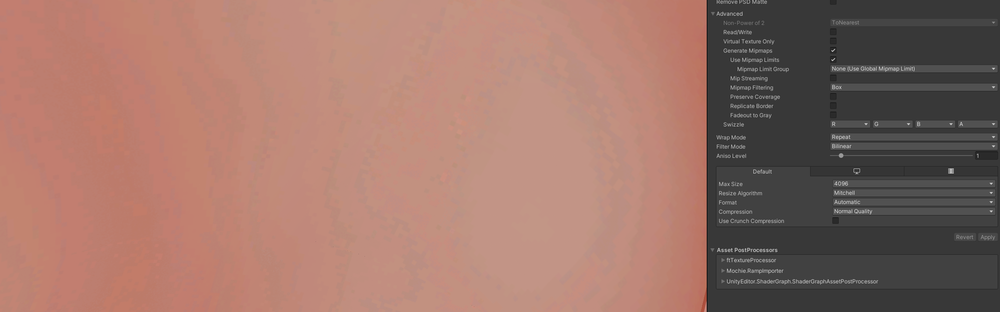
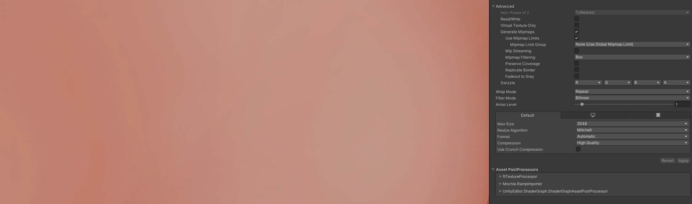
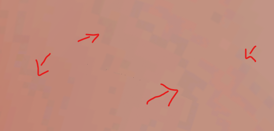
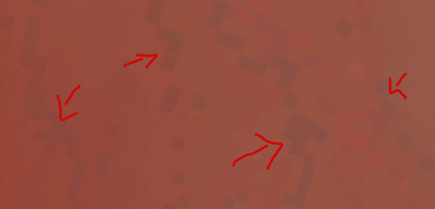

 

[Or check out my assets!](https://angelware.net/)

--- 

# Skin Texture Imports and You

Skin textures are an interesting topic in the model creation community, because there seems to be an underlying issue with understand compression on textures within Unity. 

## Optimal Settings

| Setting            | High Quality | Optimal      |
|--------------------|--------------|--------------|
| Resolution         | 2k           | <=1k         |
| Compressor         | High Quality | High Quality |
| Crunch Compression | Off          | Off          |

You're probably wondering: why these settings?

Skin is very different than most other textures, it has a hard focus on color with smooth gradients and very little detail. This is incredibly important to consider when we are choosing our settings.

### Resolution
This isn't so important on skin like it can be on other items, a resolution of 1k (or 2k max) will give us room to use High Quality compression, while still keeping our VRAM relatively low.

### Compressor Quality
This is the most important setting of all when importing skin, or anything with lots of smooth gradients with a lot of colour data. Unity has different compression types that can be controlled with this setting. On an sRGB colour texture, we use DXT1 (Normal / Low Quality) and BC7 (High Quality). The most important difference here is that [BC7 uses 8 Bits per pixel (BPP), while DXT1 uses 4BPP.](https://docs.unity3d.com/Manual/class-TextureImporterOverride.html) As you can guess, this means we have double the amount of colours to use per-pixel in our texture, which is incredibly important when using gradients.

This also means that BC7 has a higher memory usage amount, which is generally double that of DXT1. This is why for skin textures, a lower resolution and a higher compressor quality will **always look better**. Below is a very good example of the differences in quality.

#### 4k Normal Compression (DXT1)
Disk Size = 10.7mb
VRAM Size = 11.18mb

#### 2k High Quality Compression (BC7)
Disk Size = 5.3mb
VRAM Size = 5.59mb

Instantly, you can see the difference, there is extreme "color banding" on my texture using 4k with normal-quality compression, vs. the super-clean and smooth 2k high-quality version. Color banding refers to the artifacts or "pixelation" you can see in the skin's gradient.

Here is an exaggerated version for easier viewing.

> ⚠️ If you're wondering why we **never** use 4k skin textures with High-Quality compression, it's because it uses **~22mb** of VRAM, that is a **lot** and it doesn't even look better. For reference if there were 40 of you in a lobby with just that one texture, you would be using **880mb** of video memory with just your body texture alone, that is 1/8th of most graphics cards! That is completely unacceptable!

### Crunch Compression
As for crunch compression, it's generally okay to leave it **off** here. Reason being, it will diminish the quality of your textures at the cost of 3mb of disk space. You should instead use crunch compression on things like masks, where color data is less important.

Hopefully this can help you understand the benefits of using lower-resolution, higher-quality textures on your models!

Note: We didnt talk about filtering here, but you can view the [Unity Documentation](https://docs.unity3d.com/Manual/ImportingTextures.html) to understand it a bit better! VRChat has a minimum of 9 on it's anisotropic filter, so you can generally just leave this as-is, or bump it up to 16 for some extra quality.

## Further Reading
https://docs.unity3d.com/Manual/class-TextureImporterOverride.html
https://docs.unity3d.com/Manual/ImportingTextures.html