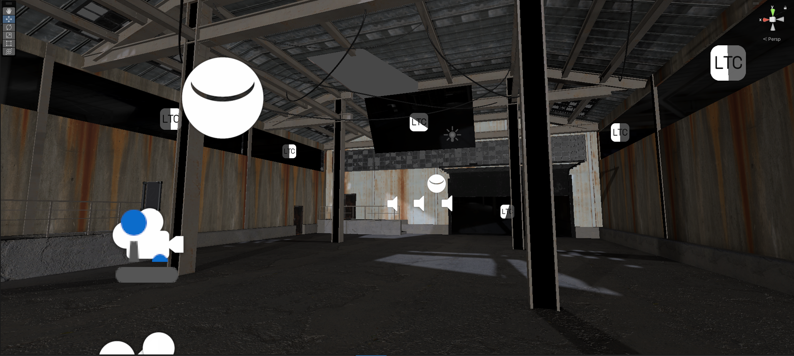
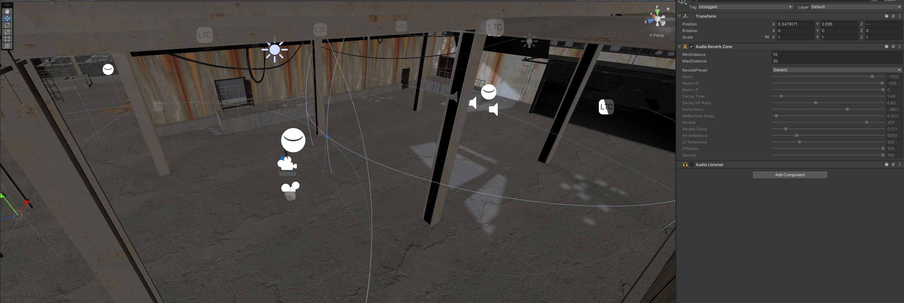
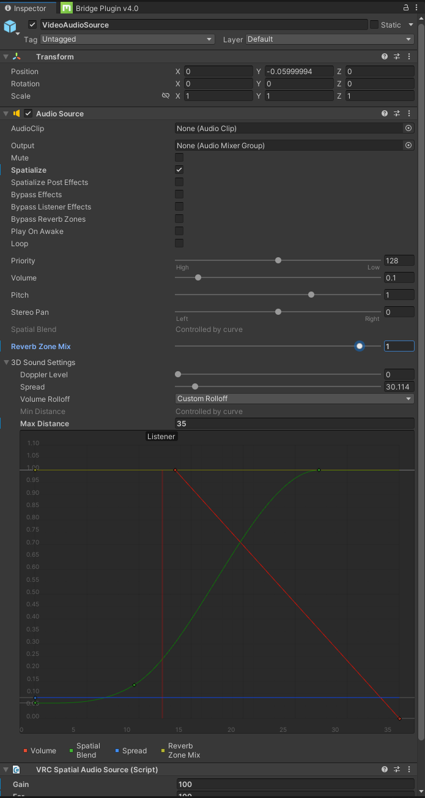
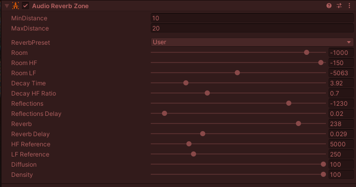

 

[Or check out my assets!](https://angelware.net/)

--- 

> This article is unfinished.

I've noticed a problem in a lot of club worlds (and others) where reverb and other effects are either completely blown out or there is just none at all. I personally find it unsettling to have direct audio in my ears when immersed in a world, however I still want to hear the tunes too! To solve this we can use some very particular settings to find a middle ground.

In real life, reverb happens naturally, and it happens everywhere, I think if we used that ideaology, sort of like we do with reflection probes, we might be able to make a better experience for users, so long as we're not overdoing it.

For some basic advice, you should never be using 100% wet on your reverbs, around 50% or less is where things should be, but never more than 50%.

As you can see this is a huge, empty, concrete environment. In real life this would sound awful, but thanks to the magic of gamedev, we could make this sound like Abbey Road Studios if we wanted. 

I'll start by creating some reverb zones.

For this demo I have made two zones that overlap with their max distances. Reverb zones can overlap and will mix in those areas. The goal here is to add more reverb as we get further from our source, which in this case is our video player.

A quick tip for getting started, choose a preset, then set the preset to user. This will retain the preset settings but allow you to edit it!

This is how I've set up my audio source, we have a 35 meter rolloff, with spatialization on and the reverb zone mix at 100%, this is because we can control our reverb amount with each reverb zone's reverb filter, and create other effects using this source as needed, such as lowpassing.

For my reverb zone, I have most of the settings set to the default Concert Hall preset, however you may notice I've turned the lower frequencies down a bit, this helps control muddiness. It's something we can't do in real life, but we can here and it greatly benefits our sound. You can also see I've left the `Reverb` slider up pretty high here, this is just for testing, we need to bring it back significantly for actual use. If you are confused about where to put this, try setting it to zero, then setting the audio source's mix to 0.5, then trying to copy that sound while it's back at 1.0.

